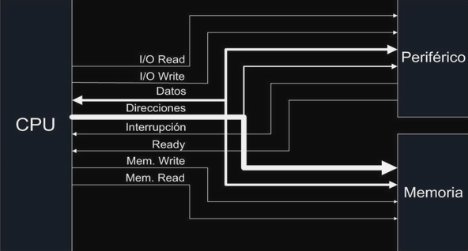
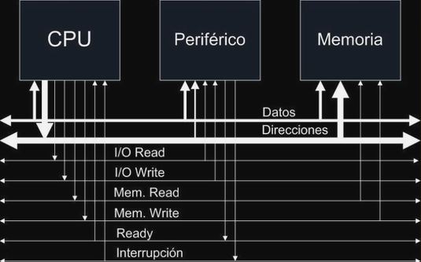
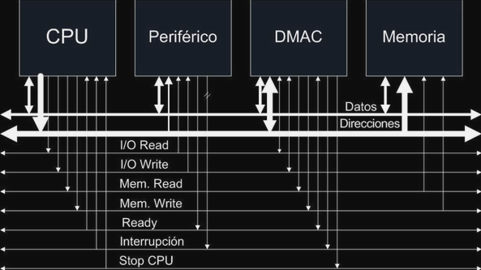
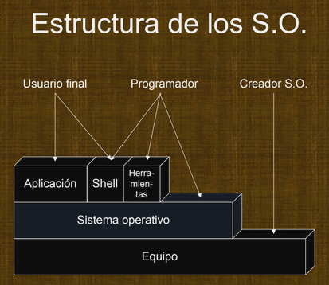
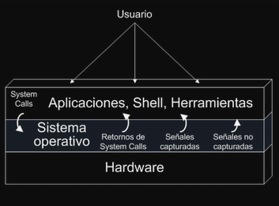
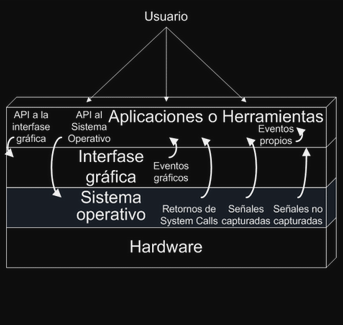
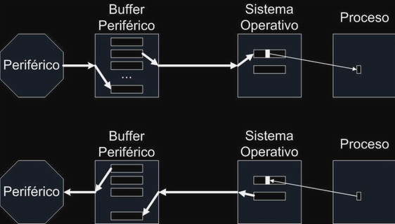
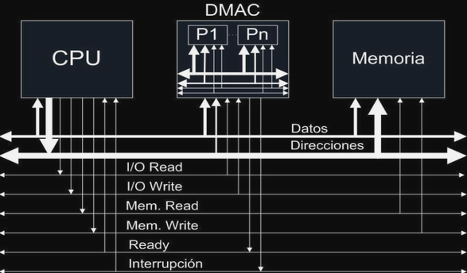
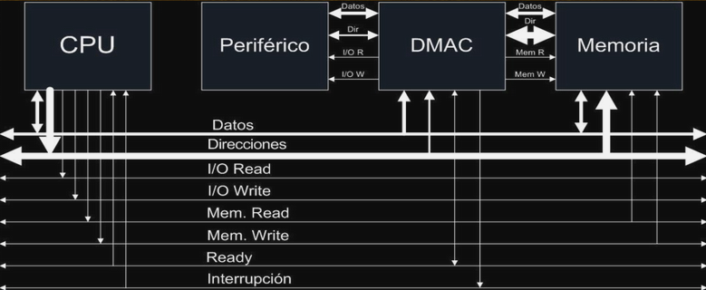

# Introducción y Evolución

## 1. Etapa Temprana y Evolución Histórica

### La Era Manual (Pre-Sistemas Operativos)

- **Ejecución rudimentaria**: Los programas se cargaban bit a bit en binario.
- **Alta tasa de error**: Proceso lento y propenso a fallas humanas.
- **Monitores**: Sistemas elementales que permitían la ejecución mediante tarjetas o cintas perforadas.
- **Origen**: Antes de la competencia entre USA y la URSS, Alemania ya había fabricado 4 computadoras.
- **Paradigma inicial**: Cálculo científico. La ejecución era de "una sola vez" y no existía el
  procesamiento de datos masivo.

### El Surgimiento del Procesamiento Batch (Lote)

Con el abaratamiento de los costos, las computadoras pasaron de las universidades a las empresas
privadas.

- **Sistemas Batch**: El SO toma un trabajo, lo coloca en una cola de ejecución y lo procesa.
- **Aprovechamiento del Recurso**: Debido al alto costo del hardware, el objetivo principal era
  maximizar el uso de la CPU.
- **Nociones clave**:
  - **Centro de cómputo**: Lugar físico de procesamiento.
  - **Operador**: Persona que gestionaba la carga de trabajos.
  - **Proceso vs. Programa**: Un _programa_ es un ente estático; un _proceso_ es un programa en ejecución
    residente en memoria.

---

## 2. Arquitectura y Gestión de Entrada/Salida (E/S)

### El Problema de la Velocidad

La CPU es órdenes de magnitud más rápida que los periféricos. Para evitar que la CPU esté ociosa,
surgieron distintos mecanismos:

1. **Instrucciones IN/OUT**: La CPU controla directamente el periférico. **No hay paralelismo**.

   

2. **Interrupciones**: Los periféricos avisan a la CPU cuando están listos o que terminaron. Esto
   permite la **conmutación de tareas**.
3. **DMA (Direct Memory Access)**: El DMA gestiona la transferencia de datos entre el periférico y la
   memoria sin intervención constante de la CPU. Solo interrumpe al finalizar la ráfaga de datos.

   

   

### Jerarquía de Hardware y el Rol del SO

El SO actúa como una capa de abstracción que oculta la complejidad del hardware:

- **Instrucciones Privilegiadas**: Solo el SO puede ejecutar instrucciones de E/S (`IN`/`OUT`). Los
  lenguajes de programación deben solicitar estas acciones al SO.

  

- **Manejo de Señales**: El SO utiliza señales para avisar a los programas sobre eventos o errores.

  

- **Ciclo de Instrucción**: Fetch (búsqueda) -> Decode (decodificación) -> Execute (ejecución).

---

## 3. Paradigmas de los Sistemas Operativos

| Paradigma             | Objetivo Principal       | Características                                                     |
| --------------------- | ------------------------ | ------------------------------------------------------------------- |
| **Batch (Lote)**      | Eficiencia de la CPU     | Ejecución secuencial, maximización de recursos.                     |
| **Tiempo Compartido** | Satisfacción del usuario | Uso de _Quantum_ (rebanada de tiempo) y _Timers_. Respuesta rápida. |
| **Tiempo Real**       | Respuesta al entorno     | Prioridad definida por eventos externos (Duro o Blando)             |

---

## 4. Gestión de Memoria y Buffers

### Cuellos de Botella

La comunicación con la memoria es significativamente más lenta que los registros internos de la CPU.

- **Cache**: Memoria rápida dentro de la CPU para mitigar la lentitud de la memoria RAM.
- **Buffers**: Espacios de memoria (gestionados por el SO pero usualmente en el espacio del proceso)
  para almacenar datos temporalmente durante la E/S.

  
  - **Doble Buffer**: Mientras uno se lee/escribe, el otro queda libre para trabajar, aumentando el
    paralelismo.
  - **Cierre (Close)**: La operación de cerrar un archivo garantiza que los buffers se vacíen
    correctamente hacia el disco.

### Velocidades Comparativas (Flujo de Datos)

- **Disco**: ~12 MB/seg (con buffer).
- **Impresora**: ~1.3 MB/seg.
- **Mouse**: 110 bytes/seg.
- **Usuario (teclado)**: 3 bytes/seg.

---

## 5. Conceptos Finales de la Clase

- **File Locking / Record Locking**: Mecanismos para evitar conflictos cuando múltiples procesos
  intentan acceder al mismo archivo o registro.
- **Mapeo de E/S**: Algunas CPUs tienen instrucciones específicas, otras mapean los periféricos
  directamente en el mapa de memoria.
- **Método por Ráfagas**: Técnica donde el DMA toma el control del bus por ciclos cortos para enviar
  grandes volúmenes de datos.

  

  
